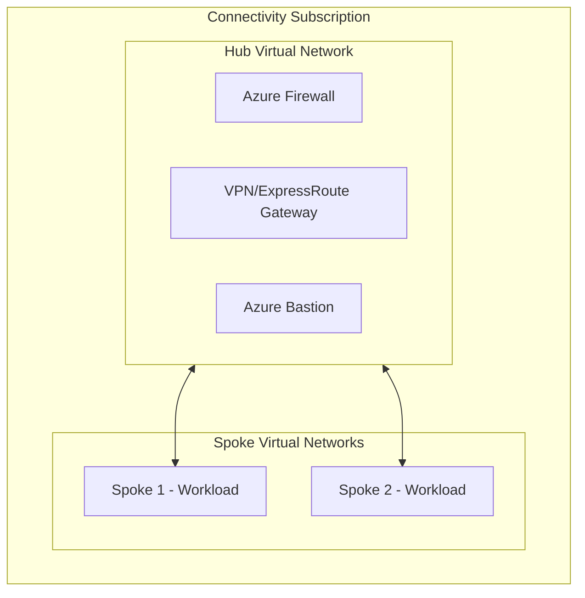

# Stacks Azure Platform Landing Zone - Connectivity (Hub & Spoke)

This module deploys connectivity resources using the traditional Hub and Spoke network topology. It provides centralized network infrastructure with a hub virtual network and peered spoke networks for Azure Landing Zones.

## Architecture



## Features

| Feature | Default | Description |
| ------- | ------- | ----------- |
| Hub Virtual Network | ✅ | Central hub for network connectivity |
| Azure Firewall | ❌ | Network security and filtering |
| VPN Gateway | ❌ | Site-to-site VPN connectivity |
| ExpressRoute Gateway | ❌ | Private connectivity to on-premises |
| Azure Bastion | ❌ | Secure VM access without public IPs |
| DDoS Protection | ❌ | DDoS protection plan |

## Usage

```hcl
module "connectivity_hub_spoke" {
  source = "./deploy/terraform"

  company_name        = "ensono"
  environment         = "dev"
  location            = "uksouth"
  hub_address_space   = ["10.0.0.0/16"]
}
```

## Requirements

| Name | Version |
|------|---------|
| terraform | >= 1.9 |
| azurerm | ~> 4.1.0 |
