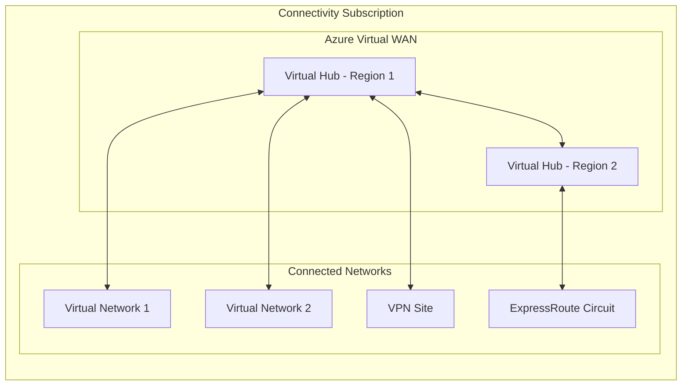

# Stacks Azure Platform Landing Zone - Connectivity (Virtual WAN)

This module deploys connectivity resources using Azure Virtual WAN. It provides a Microsoft-managed global transit network architecture for Azure Landing Zones with simplified any-to-any connectivity.

## Architecture



## Features

| Feature | Default | Description |
| ------- | ------- | ----------- |
| Virtual WAN | ✅ | Global transit network |
| Virtual Hub | ✅ | Regional hub for connectivity |
| Azure Firewall | ❌ | Secured Virtual Hub |
| VPN Gateway | ❌ | Site-to-site VPN connectivity |
| ExpressRoute Gateway | ❌ | Private connectivity to on-premises |
| P2S VPN | ❌ | Point-to-site VPN for users |
| Routing Intent | ❌ | Centralized routing policies |

## Usage

```hcl
module "connectivity_vwan" {
  source = "./deploy/terraform"

  company_name        = "ensono"
  environment         = "dev"
  location            = "uksouth"
  virtual_wan_type    = "Standard"
}
```

## Requirements

| Name | Version |
|------|---------|
| terraform | >= 1.9 |
| azurerm | ~> 4.1.0 |
