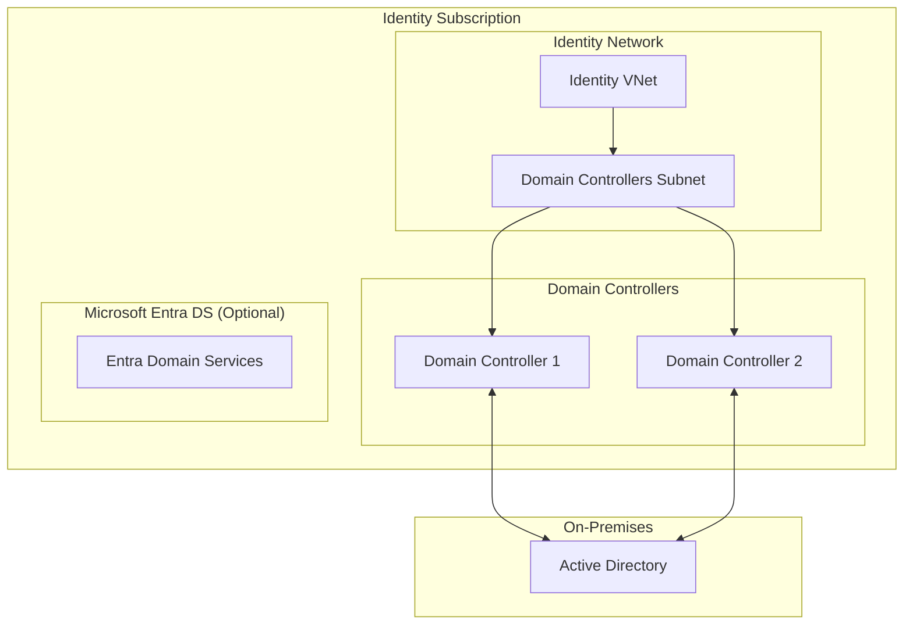

# Stacks Azure Platform Landing Zone - Identity

This module deploys identity resources for Azure Landing Zones. It provides Active Directory Domain Services (ADDS), Microsoft Entra Domain Services, or hybrid identity components for centralized identity management.

## Architecture



## Features

| Feature | Default | Description |
| ------- | ------- | ----------- |
| Identity VNet | ✅ | Dedicated network for identity services |
| Domain Controller VMs | ❌ | Windows Server VMs for AD DS |
| Microsoft Entra DS | ❌ | Managed domain services |
| DNS Configuration | ❌ | Private DNS zones for domain resolution |
| Key Vault | ❌ | Secrets storage for credentials |
| Backup | ❌ | Recovery Services vault for DCs |

## Usage

```hcl
module "identity" {
  source = "./deploy/terraform"

  company_name        = "ensono"
  environment         = "dev"
  location            = "uksouth"
  address_space       = ["10.1.0.0/16"]
}
```

## Requirements

| Name | Version |
|------|---------|
| terraform | >= 1.9 |
| azurerm | ~> 4.1.0 |
