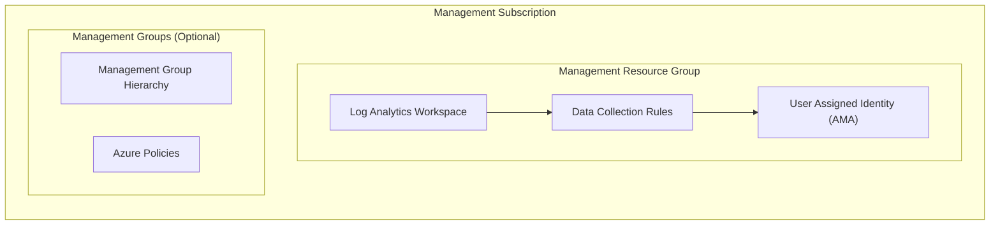
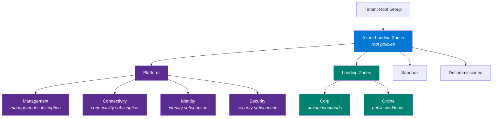

<!-- BEGIN_TF_DOCS -->
<!-- Code generated by terraform-docs. DO NOT EDIT. -->
# Stacks Azure Platform Landing Zone - Management

This module deploys management resources using Azure Verified Modules (AVM). It provides centralized logging, monitoring, and an optional default management group architecture for Azure Landing Zones.

## Architecture



## Features

| Feature | Default | Description |
| ------- | ------- | ----------- |
| Log Analytics Workspace | ✅ | Central logging for all Azure resources |
| Data Collection Rules | ✅ | Change Tracking, VM Insights (Defender for SQL optional) |
| Azure Monitor Agent Identity | ✅ | User-assigned managed identity for AMA |
| Resource Group Locks | ✅ | `CanNotDelete` locks on resource groups |
| Log Analytics Diagnostics | ✅ | Self-monitoring diagnostic settings |
| Subscription Activity Logs | ✅ | Routes Activity Logs into Log Analytics |
| Health Monitoring Alerts | ❌ | Latency, search availability, query failures/runtime, ingestion guardrails |
| Management Groups | ❌ | Management group hierarchy with policies |

## Configuration Examples

### Management Resources Only (Default)

Deploys Log Analytics and Data Collection Rules with sensible defaults:

```hcl
company_name               = "ensono"
location                   = "uksouth"
management_subscription_id = "00000000-0000-0000-0000-000000000000"
```

### Customising Management Resources

Override specific settings while using defaults for the rest:

```hcl
company_name               = "ensono"
location                   = "uksouth"
management_subscription_id = "00000000-0000-0000-0000-000000000000"

# Customize retention and disable VM Insights DCR
management_resource_settings = {
  log_analytics_workspace_retention_in_days = 90

  data_collection_rules = {
    vm_insights = { enabled = false }
  }
}
```

### Full Azure Landing Zone with Management Groups

Deploy a complete Azure Landing Zone management group architecture with policies:

```hcl
company_name               = "ensono"
location                   = "uksouth"
management_subscription_id = "00000000-0000-0000-0000-000000000000"

# Required: Platform subscriptions
connectivity_subscription_id = "11111111-1111-1111-1111-111111111111"
identity_subscription_id     = "22222222-2222-2222-2222-222222222222"

# Optional: Security subscription
# security_subscription_id = "33333333-3333-3333-3333-333333333333"

# Enable management groups (deploys under tenant root group by default)
management_groups_enabled = true
}
```

#### Management Group Architecture

When `management_groups_enabled = true`, the module deploys the following Azure Landing Zone management group architecture:



>[!NOTE]
> Platform subscriptions are automatically placed into their respective management groups when subscription IDs are provided.

> [!NOTE]
> Management Groups deployments require elevated permissions (`Management Group Contributor` at Tenant Root level, and `Owner` in each subscription).

#### Customising Management Groups

##### Updating the Management Group Architecture

If the architecture needs to be changed, ensure you update the [alz\_custom.alz\_architecture\_definition.yaml](./deploy/terraform/lib/architecture\_definitions/alz\_custom.alz\_architecture\_definition.yaml) file to suit your requirements.

##### Existing Management Group

It's recommended to keep the hierarchy flat where possible, but if an existing management group is being used as the root, ensure you update the [alz\_custom.alz\_architecture\_definition.yaml](./deploy/terraform/lib/architecture\_definitions/alz\_custom.alz\_architecture\_definition.yaml) file. For example

```yaml
management_groups:
  - id: existing_group
    display_name: Existing Group
    archetypes:
      - root
    parent_id: null # setting to null indicates to the provider that we should use the parent resource id
    exists: true
```

#### Using Azure Landing Zones Library Policies (No Customisation)

The module by default uses the standard [ALZ Library](https://github.com/Azure/Azure-Landing-Zones-Library/tree/main/platform/alz) policies without custom overrides. Policy default values and assignments are managed in the [locals\_policy\_assignments.tf](./deploy/terraform/locals\_policy\_assignments.tf) file.

#### Development/Testing (Single Subscription)

For testing with only a management subscription:

```hcl
management_subscription_id = "00000000-0000-0000-0000-000000000000"

management_groups_enabled    = true
skip_subscription_placement  = true  # Skips connectivity/identity validation
```

## Integration with Connectivity Module

The management module outputs are consumed by the connectivity module via Terraform remote state:

**Management module outputs:**

- `log_analytics_workspace_id` - Used for AMPLS and diagnostics
- `log_analytics_workspace_name` - Log Analytics Workspace name
- `log_analytics_workspace_guid` - Used for Traffic Analytics

**Connectivity module configuration:**

```hcl
management_remote_state = {
  storage_account_name = "<tfstate-storage-account>"
}
```

## Azure Monitor Private Link Scope (AMPLS)

This module is designed to work with AMPLS deployed by the connectivity module. By default, Log Analytics is configured with secure settings that require private connectivity:

| Setting | Default | Description |
| ------- | ------- | ----------- |
| `internet_ingestion_enabled` | `false` | Blocks data ingestion from public internet |
| `internet_query_enabled` | `false` | Blocks queries from public internet |
| `local_authentication_enabled` | `false` | Requires Entra ID authentication |

### Deployment Order

1. **Management module** - Creates Log Analytics Workspace with private-only settings
2. **Connectivity module** - Creates AMPLS and links Log Analytics to private network

### Enabling Public Access (Development Only)

For development environments without private networking, you can enable public access:

```hcl
management_resource_settings = {
  # Enable public access for development/testing (not recommended for production)
  log_analytics_workspace_internet_ingestion_enabled   = true
  log_analytics_workspace_internet_query_enabled       = true
  log_analytics_workspace_local_authentication_enabled = true
}
```

> [!WARNING]
> Enabling public access reduces security. Use only in development environments where AMPLS is not deployed.

## Reliability and Zone Redundancy

The module implements Azure Well-Architected Framework reliability best practices:

### Log Analytics Workspace

| Feature | Status | Notes |
| ------- | ------ | ----- |
| Data Resilience | ✅ Automatic | Data replicated across availability zones in supported regions |
| Service Resilience | ⚠️ Regional | Requires dedicated cluster for full zone-redundant service operations |
| Diagnostics | ✅ Enabled | Self-monitoring via diagnostic settings |

**Supported regions for data resilience**: UK South, West Europe, East US, West US 2, and [others](https://learn.microsoft.com/azure/azure-monitor/logs/availability-zones#supported-regions).

### For High Availability Requirements

For mission-critical deployments requiring service resilience (not just data resilience):

```hcl
# Consider dedicated clusters for high-volume, mission-critical workloads
# Requires 500+ GB/day commitment
management_resource_settings = {
  log_analytics_workspace_sku = "CapacityReservation"
  log_analytics_workspace_reservation_capacity_in_gb_per_day = 500
}
```

> [!NOTE]
> Dedicated clusters provide service resilience (query availability during zone failures) but require minimum 500 GB/day commitment. For most workloads, standard data resilience is sufficient.

## Health Monitoring Alerts

The module supports optional Azure Monitor health monitoring alerts to ensure the observability infrastructure remains healthy. Alerts require an Action Group so notifications always reach operations teams. Provide an action group ID (and optional overrides) to enable all alerts:

```hcl
monitoring_alerts = {
  action_group_id                         = "/subscriptions/.../actionGroups/platform-alerts"
  ingestion_latency_threshold_seconds     = 60   # default 120
  data_ingest_threshold_gb                = 50   # default 100
  search_availability_threshold_percent   = 99.5 # default 99
  query_duration_threshold_ms             = 20000 # default 15000
  enable_query_failure_alerts             = true  # default true
  query_failure_threshold                 = 10    # default 5
}
```

> [!NOTE]
> If `monitoring_alerts.enabled = true` (or an action group is supplied), an Action Group ID must be provided. This keeps alerts actionable and prevents silent monitoring failures.

### Alert Types

| Alert | Severity | Description |
| ----- | -------- | ----------- |
| Ingestion Latency | 2 (Warning) | Triggers when data ingestion latency exceeds threshold |
| Search Availability | 2 (Warning) | Triggers when SearchableResultsAvailability drops below threshold |
| Query Failures | 2 (Warning) | Triggers when query failures exceed threshold |
| Slow Query Runtime | 3 (Informational) | Triggers when QueryStoreRuntimeStatistics shows long-running queries |
| Data Ingestion Guardrail | 3 (Informational) | Triggers when daily data ingestion exceeds budgeted GB |

> [!NOTE]
> Create an Action Group in Azure Monitor before enabling alerts to receive notifications via email, SMS, webhook, or other channels.

## Estimated Monthly Costs

The following table provides estimated monthly costs for typical deployments. Actual costs vary based on data ingestion volume, retention, and region.

| Resource | Configuration | Estimated Cost (GBP) |
| -------- | ------------- | -------------------- |
| Log Analytics Workspace | PerGB2018, ~5 GB/day | ~£58/month |
| Data Collection Rules | N/A | Included |
| User Assigned Managed Identity | N/A | Free |
| Management Groups | N/A | Free |
| Azure Policies | N/A | Free |

**Typical Total**: ~£58/month (varies by ingestion volume)

> [!TIP]
>
> - Use [Azure Pricing Calculator](https://azure.microsoft.com/pricing/calculator/) for precise estimates
> - Consider commitment tiers for 15-25% savings on predictable workloads (100+ GB/day)
> - Set `log_analytics_workspace_daily_quota_gb` to cap unexpected ingestion costs

## Cost Optimization

The module follows Azure Well-Architected Framework cost optimization guidance:

### Log Analytics Workspace Cost Settings

| Setting | Default | Cost Impact |
| ------- | ------- | ----------- |
| `log_analytics_workspace_daily_quota_gb` | `-1` (unlimited) | Set a cap to prevent runaway costs |
| `log_analytics_workspace_sku` | `PerGB2018` | Pay-as-you-go pricing |
| `log_analytics_workspace_reservation_capacity_in_gb_per_day` | `null` | Use commitment tiers for 15-25% savings |

**Commitment tier pricing** (requires `sku = "CapacityReservation"`):

```hcl
management_resource_settings = {
  log_analytics_workspace_sku                                = "CapacityReservation"
  log_analytics_workspace_reservation_capacity_in_gb_per_day = 100  # 100, 200, 300, 400, or 500 GB/day
}
```

## Resource Naming

Resources follow Cloud Adoption Framework (CAF) naming conventions using the [Azure Naming module](https://registry.terraform.io/modules/Azure/naming/azurerm/latest):

| Resource | Pattern | Example |
| -------- | ------- | ------- |
| Resource Group | `rg-{company}-{region}-{env}-man-001` | `rg-ens-uks-dev-man-001` |
| Log Analytics | `log-{company}-{region}-{env}-man-001` | `log-ens-uks-dev-man-001` |
| User Assigned Identity | `uai-ama` | `uai-ama` |
| Data Collection Rule | `dcr-{type}` | `dcr-change-tracking` |

### Naming Strategy

The module uses deterministic naming with `001` suffixes for all resources by default. This ensures resource names are known at plan time, which is [required for ALZ policy assignments](https://registry.terraform.io/modules/Azure/avm-ptn-alz/azurerm/latest#unknown-values--depends-on).

### Data Collection Rule Names

DCR names use AVM defaults but can be customized:

| DCR | Default Name | Description |
| --- | ------------ | ----------- |
| Change Tracking | `dcr-change-tracking` | File and registry change monitoring |
| VM Insights | `dcr-vm-insights` | VM performance and dependency data |
| Defender for SQL | `dcr-defender-sql` | SQL security telemetry |

To override DCR names:

```hcl
management_resource_settings = {
  data_collection_rules = {
    change_tracking = { name = "dcr-custom-change-tracking" }
    vm_insights     = { name = "dcr-custom-vm-insights" }
    defender_sql    = { enabled = true, name = "dcr-custom-defender-sql" }
  }
}
```

<!-- markdownlint-disable MD033 -->
## Requirements

The following requirements are needed by this module:

- <a name="requirement_terraform"></a> [terraform](#requirement\_terraform) (~> 1.12)

- <a name="requirement_alz"></a> [alz](#requirement\_alz) (0.20.2)

- <a name="requirement_azapi"></a> [azapi](#requirement\_azapi) (~> 2.0)

- <a name="requirement_azurerm"></a> [azurerm](#requirement\_azurerm) (~> 4.0)

- <a name="requirement_modtm"></a> [modtm](#requirement\_modtm) (~> 0.3)

- <a name="requirement_random"></a> [random](#requirement\_random) (~> 3.8)

## Resources

The following resources are used by this module:

- [azurerm_monitor_diagnostic_setting.log_analytics_workspace](https://registry.terraform.io/providers/hashicorp/azurerm/latest/docs/resources/monitor_diagnostic_setting) (resource)
- [azurerm_monitor_diagnostic_setting.subscription_activity](https://registry.terraform.io/providers/hashicorp/azurerm/latest/docs/resources/monitor_diagnostic_setting) (resource)
- [azurerm_monitor_metric_alert.law_data_ingest](https://registry.terraform.io/providers/hashicorp/azurerm/latest/docs/resources/monitor_metric_alert) (resource)
- [azurerm_monitor_metric_alert.law_ingestion_latency](https://registry.terraform.io/providers/hashicorp/azurerm/latest/docs/resources/monitor_metric_alert) (resource)
- [azurerm_monitor_metric_alert.law_search_availability](https://registry.terraform.io/providers/hashicorp/azurerm/latest/docs/resources/monitor_metric_alert) (resource)
- [azurerm_monitor_scheduled_query_rules_alert_v2.law_query_failures](https://registry.terraform.io/providers/hashicorp/azurerm/latest/docs/resources/monitor_scheduled_query_rules_alert_v2) (resource)
- [azurerm_monitor_scheduled_query_rules_alert_v2.law_query_runtime](https://registry.terraform.io/providers/hashicorp/azurerm/latest/docs/resources/monitor_scheduled_query_rules_alert_v2) (resource)
- [terraform_data.monitoring_alerts_require_action_group](https://registry.terraform.io/providers/hashicorp/terraform/latest/docs/resources/data) (resource)
- [terraform_data.validate_subscriptions](https://registry.terraform.io/providers/hashicorp/terraform/latest/docs/resources/data) (resource)
- [azapi_client_config.current](https://registry.terraform.io/providers/Azure/azapi/latest/docs/data-sources/client_config) (data source)

<!-- markdownlint-disable MD013 -->
## Required Inputs

The following input variables are required:

### <a name="input_company_name"></a> [company\_name](#input\_company\_name)

Description: Company name used in resource naming. The first 3 characters are used as a prefix (e.g., 'ensono' becomes 'ens').

Type: `string`

### <a name="input_location"></a> [location](#input\_location)

Description: Primary Azure region for management resources (e.g., 'uksouth').

Type: `string`

### <a name="input_management_subscription_id"></a> [management\_subscription\_id](#input\_management\_subscription\_id)

Description: Subscription ID for management resources (log analytics, DCRs, storage).

Type: `string`

## Optional Inputs

The following input variables are optional (have default values):

### <a name="input_connectivity_subscription_id"></a> [connectivity\_subscription\_id](#input\_connectivity\_subscription\_id)

Description: Subscription ID to place in the 'connectivity' management group.

Required when `management_groups_enabled = true`. Can be omitted when testing with management resources only.

Type: `string`

Default: `null`

### <a name="input_enable_avm_telemetry"></a> [enable\_avm\_telemetry](#input\_enable\_avm\_telemetry)

Description: Enable telemetry collection for Azure Verified Modules. See https://aka.ms/avm/telemetryinfo.

Type: `bool`

Default: `false`

### <a name="input_identity_subscription_id"></a> [identity\_subscription\_id](#input\_identity\_subscription\_id)

Description: Subscription ID to place in the 'identity' management group.

Required when `management_groups_enabled = true` for standard ALZ deployments.  
Can be omitted for cloud-native organisations using only Microsoft Entra ID (set `skip_identity_subscription_check = true`).

Type: `string`

Default: `null`

### <a name="input_management_group_settings"></a> [management\_group\_settings](#input\_management\_group\_settings)

Description: The settings for the management groups. This object configures the Azure Landing Zone management group hierarchy, policies, and role assignments.

Properties:
- `architecture_name` - (Optional) The name of the architecture definition to use. Defaults to "alz\_custom".
- `parent_management_group_id` - (Optional) The ID/name of the parent management group (e.g., tenant ID or management group name). If omitted, defaults to the tenant root group.
- `location` - (Required) The default Azure region for resources.
- `policy_default_values` - (Optional) A map of default values for policy parameters.
- `policy_assignments_to_modify` - (Optional) Map of policy assignments to modify:
  - `policy_assignments` - Map of policy assignment modifications:
    - `enforcement_mode` - (Optional) The enforcement mode for the policy assignment.
    - `identity` - (Optional) The type of managed identity for the policy assignment.
    - `identity_ids` - (Optional) List of user-assigned identity resource IDs.
    - `parameters` - (Optional) Map of parameter values for the policy assignment.
    - `non_compliance_messages` - (Optional) Set of non-compliance messages:
      - `message` - (Required) The non-compliance message.
      - `policy_definition_reference_id` - (Optional) The policy definition reference ID.
    - `resource_selectors` - (Optional) List of resource selectors:
      - `name` - (Required) The name of the resource selector.
      - `resource_selector_selectors` - (Optional) List of selector criteria:
        - `kind` - (Required) The kind of selector.
        - `in` - (Optional) Set of values to include.
        - `not_in` - (Optional) Set of values to exclude.
    - `overrides` - (Optional) List of policy overrides:
      - `kind` - (Required) The kind of override.
      - `value` - (Required) The override value.
      - `override_selectors` - (Optional) List of override selectors:
        - `kind` - (Required) The kind of selector.
        - `in` - (Optional) Set of values to include.
        - `not_in` - (Optional) Set of values to exclude.
- `management_group_hierarchy_settings` - (Optional) Settings for the management group hierarchy:
  - `default_management_group_name` - (Optional) The management group where new subscriptions are placed. Defaults to "sandbox" per CAF recommendation.
  - `require_authorization_for_group_creation` - (Optional) Require authorization for management group creation. Defaults to true.
  - `update_existing` - (Optional) Update existing management groups. Defaults to false.
- `partner_id` - (Optional) The partner ID for Azure partner attribution.
- `retries` - (Optional) Retry configurations for various resource types:
  - `management_groups`, `role_definitions`, `role_assignments`, `policy_definitions`, `policy_set_definitions`, `policy_assignments`, `policy_role_assignments`, `hierarchy_settings`, `subscription_placement` - Each has the following retry settings:
    - `error_message_regex` - (Optional) List of regex patterns to match error messages for retry.
    - `interval_seconds` - (Optional) The initial retry interval in seconds.
    - `max_interval_seconds` - (Optional) The maximum retry interval in seconds.
    - `multiplier` - (Optional) The multiplier for exponential backoff.
    - `randomization_factor` - (Optional) The randomization factor for retry intervals.
- `subscription_placement` - (Optional) Map of subscription placement configurations:
  - `subscription_id` - (Required) The subscription ID to place.
  - `management_group_name` - (Required) The target management group name.
- `timeouts` - (Optional) Timeout configurations for various resource types:
  - `management_group`, `role_definition`, `role_assignment`, `policy_definition`, `policy_set_definition`, `policy_assignment`, `policy_role_assignment` - Each has the following timeout settings:
    - `create` - (Optional) Timeout for create operations.
    - `delete` - (Optional) Timeout for delete operations.
    - `update` - (Optional) Timeout for update operations.
    - `read` - (Optional) Timeout for read operations.
- `dependencies` - (Optional) Dependency configurations:
  - `management_groups` - (Optional) Dependencies for management group creation.
  - `policy_role_assignments` - (Optional) Dependencies for policy role assignments.
  - `policy_assignments` - (Optional) Dependencies for policy assignments.
- `override_policy_definition_parameter_assign_permissions_set` - (Optional) Set of policy definition parameters to assign permissions:
  - `definition_name` - (Required) The policy definition name.
  - `parameter_name` - (Required) The parameter name.
- `override_policy_definition_parameter_assign_permissions_unset` - (Optional) Set of policy definition parameters to unset permissions:
  - `definition_name` - (Required) The policy definition name.
  - `parameter_name` - (Required) The parameter name.
- `management_group_role_assignments` - (Optional) Map of management group role assignments:
  - `management_group_name` - (Required) The target management group name.
  - `role_definition_id_or_name` - (Required) The role definition ID or name.
  - `principal_id` - (Required) The principal ID to assign the role to.
  - `description` - (Optional) Description of the role assignment.
  - `skip_service_principal_aad_check` - (Optional) Skip service principal AAD check. Defaults to false.
  - `condition` - (Optional) The condition for the role assignment.
  - `condition_version` - (Optional) The condition version.
  - `delegated_managed_identity_resource_id` - (Optional) The delegated managed identity resource ID.
  - `principal_type` - (Optional) The type of principal.
- `role_assignment_definition_lookup_enabled` - (Optional) Enable role definition lookup for assignments. Defaults to true.
- `policy_assignment_non_compliance_message_settings` - (Optional) Settings for policy non-compliance messages:
  - `fallback_message_enabled` - (Optional) Enable fallback messages.
  - `fallback_message` - (Optional) The fallback message text.
  - `fallback_message_unsupported_assignments` - (Optional) List of unsupported assignment names.
  - `enforcement_mode_placeholder` - (Optional) Placeholder for enforcement mode.
  - `enforced_replacement` - (Optional) Replacement text for enforced mode.
  - `not_enforced_replacement` - (Optional) Replacement text for not enforced mode.
- `role_assignment_name_use_random_uuid` - (Optional) Use random UUID for role assignment names. Defaults to true.
- `subscription_placement_destroy_behavior` - (Optional) Behavior when destroying subscription placement. Possible values: "parent", "intermediate\_root", "custom", "default". Defaults to "default".
- `subscription_placement_destroy_custom_target_management_group_id` - (Optional) Target management group ID when using "custom" destroy behavior.

Details of the settings can be found in the module documentation at https://registry.terraform.io/modules/Azure/avm-ptn-alz

Type:

```hcl
object({
    architecture_name            = optional(string, "alz_custom")
    parent_management_group_id   = optional(string)
    location                     = optional(string)
    policy_default_values        = optional(any)
    policy_assignments_to_modify = optional(any)
    management_group_hierarchy_settings = optional(object({
      default_management_group_name            = optional(string, "sandbox")
      require_authorization_for_group_creation = optional(bool, true)
      update_existing                          = optional(bool, false)
    }))
    partner_id = optional(string)
    retries = optional(object({
      management_groups = optional(object({
        error_message_regex  = optional(list(string))
        interval_seconds     = optional(number)
        max_interval_seconds = optional(number)
        multiplier           = optional(number)
        randomization_factor = optional(number)
      }))
      role_definitions = optional(object({
        error_message_regex  = optional(list(string))
        interval_seconds     = optional(number)
        max_interval_seconds = optional(number)
        multiplier           = optional(number)
        randomization_factor = optional(number)
      }))
      role_assignments = optional(object({
        error_message_regex  = optional(list(string))
        interval_seconds     = optional(number)
        max_interval_seconds = optional(number)
        multiplier           = optional(number)
        randomization_factor = optional(number)
      }))
      policy_definitions = optional(object({
        error_message_regex  = optional(list(string))
        interval_seconds     = optional(number)
        max_interval_seconds = optional(number)
        multiplier           = optional(number)
        randomization_factor = optional(number)
      }))
      policy_set_definitions = optional(object({
        error_message_regex  = optional(list(string))
        interval_seconds     = optional(number)
        max_interval_seconds = optional(number)
        multiplier           = optional(number)
        randomization_factor = optional(number)
      }))
      policy_assignments = optional(object({
        error_message_regex  = optional(list(string))
        interval_seconds     = optional(number)
        max_interval_seconds = optional(number)
        multiplier           = optional(number)
        randomization_factor = optional(number)
      }))
      policy_role_assignments = optional(object({
        error_message_regex  = optional(list(string))
        interval_seconds     = optional(number)
        max_interval_seconds = optional(number)
        multiplier           = optional(number)
        randomization_factor = optional(number)
      }))
      hierarchy_settings = optional(object({
        error_message_regex  = optional(list(string))
        interval_seconds     = optional(number)
        max_interval_seconds = optional(number)
        multiplier           = optional(number)
        randomization_factor = optional(number)
      }))
      subscription_placement = optional(object({
        error_message_regex  = optional(list(string))
        interval_seconds     = optional(number)
        max_interval_seconds = optional(number)
        multiplier           = optional(number)
        randomization_factor = optional(number)
      }))
    }), {})
    subscription_placement = optional(map(object({
      subscription_id       = string
      management_group_name = string
    })))
    timeouts = optional(object({
      management_group = optional(object({
        create = optional(string, "60m")
        delete = optional(string, "60m")
        update = optional(string, "60m")
        read   = optional(string, "60m")
      }), {})
      role_definition = optional(object({
        create = optional(string, "60m")
        delete = optional(string, "60m")
        update = optional(string, "60m")
        read   = optional(string, "60m")
      }), {})
      role_assignment = optional(object({
        create = optional(string, "60m")
        delete = optional(string, "60m")
        update = optional(string, "60m")
        read   = optional(string, "60m")
      }), {})
      policy_definition = optional(object({
        create = optional(string, "60m")
        delete = optional(string, "60m")
        update = optional(string, "60m")
        read   = optional(string, "60m")
      }), {})
      policy_set_definition = optional(object({
        create = optional(string, "60m")
        delete = optional(string, "60m")
        update = optional(string, "60m")
        read   = optional(string, "60m")
      }), {})
      policy_assignment = optional(object({
        create = optional(string, "60m")
        delete = optional(string, "60m")
        update = optional(string, "60m")
        read   = optional(string, "60m")
      }), {})
      policy_role_assignment = optional(object({
        create = optional(string, "60m")
        delete = optional(string, "60m")
        update = optional(string, "60m")
        read   = optional(string, "60m")
      }), {})
    }), {})
    dependencies = optional(object({
      management_groups       = optional(any)
      policy_role_assignments = optional(any)
      policy_assignments      = optional(any)
    }))
    override_policy_definition_parameter_assign_permissions_set = optional(set(object({
      definition_name = string
      parameter_name  = string
    })))
    override_policy_definition_parameter_assign_permissions_unset = optional(set(object({
      definition_name = string
      parameter_name  = string
    })))
    management_group_role_assignments = optional(map(object({
      management_group_name                  = string
      role_definition_id_or_name             = string
      principal_id                           = string
      description                            = optional(string)
      skip_service_principal_aad_check       = optional(bool, false)
      condition                              = optional(string)
      condition_version                      = optional(string)
      delegated_managed_identity_resource_id = optional(string)
      principal_type                         = optional(string)
    })))
    role_assignment_definition_lookup_enabled = optional(bool, true)
    policy_assignment_non_compliance_message_settings = optional(object({
      fallback_message_enabled                 = optional(bool)
      fallback_message                         = optional(string)
      fallback_message_unsupported_assignments = optional(list(string))
      enforcement_mode_placeholder             = optional(string)
      enforced_replacement                     = optional(string)
      not_enforced_replacement                 = optional(string)
    }))
    role_assignment_name_use_random_uuid                             = optional(bool, true)
    subscription_placement_destroy_behavior                          = optional(string, "default")
    subscription_placement_destroy_custom_target_management_group_id = optional(string)
  })
```

Default: `null`

### <a name="input_management_groups_enabled"></a> [management\_groups\_enabled](#input\_management\_groups\_enabled)

Description: Enable or disable the deployment of management groups.

When set to `true`, the management group hierarchy will be created and configured according to the `management_group_settings` variable.  
When set to `false`, no management groups will be deployed.

Type: `bool`

Default: `false`

### <a name="input_management_resource_settings"></a> [management\_resource\_settings](#input\_management\_resource\_settings)

Description: Configuration for Azure Landing Zone management resources including Log Analytics and monitoring solutions.

All settings are optional with sensible defaults. Set to `{}` to deploy with defaults.

Properties:
- `resource_group_name` - (Optional) Override the resource group name. Defaults to naming convention.
- `log_analytics_workspace_name` - (Optional) Override the Log Analytics workspace name. Defaults to naming convention.
- `data_collection_rules` - (Optional) Data collection rule configurations:
  - `change_tracking` - Change tracking DCR. Defaults to enabled.
  - `vm_insights` - VM insights DCR. Defaults to enabled.
  - `defender_sql` - Defender for SQL DCR. Defaults to disabled.
- `log_analytics_solution_plans` - (Optional) Solution plans to deploy to the workspace.
- `log_analytics_workspace_allow_resource_only_permissions` - (Optional) Allow resource-only permissions. Defaults to true.
- `log_analytics_workspace_cmk_for_query_forced` - (Optional) Force CMK for queries.
- `log_analytics_workspace_daily_quota_gb` - (Optional) Daily ingestion quota in GB.
- `log_analytics_workspace_internet_ingestion_enabled` - (Optional) Enable internet ingestion. Defaults to false.
- `log_analytics_workspace_internet_query_enabled` - (Optional) Enable internet queries. Defaults to false.
- `log_analytics_workspace_local_authentication_enabled` - (Optional) Enable local authentication. Defaults to false.
- `log_analytics_workspace_reservation_capacity_in_gb_per_day` - (Optional) Reservation capacity for CapacityReservation SKU.
- `log_analytics_workspace_retention_in_days` - (Optional) Data retention period in days.
- `log_analytics_workspace_sku` - (Optional) Workspace SKU (PerGB2018 or CapacityReservation).
- `tags` - (Optional) Tags for management resources. Merged with root tags.
- `timeouts` - (Optional) Timeout configurations for data collection rules.
- `user_assigned_managed_identities` - (Optional) Managed identity for Azure Monitor Agent. Defaults to enabled.

**Reliability:** Log Analytics provides zone-redundant data storage in supported regions.
**Cost:** Use CapacityReservation SKU for 15-25% savings on 100+ GB/day workloads.

Details of the settings can be found in the module documentation at https://registry.terraform.io/modules/Azure/avm-ptn-alz-management

Type:

```hcl
object({
    resource_group_name          = optional(string)
    log_analytics_workspace_name = optional(string)
    data_collection_rules = optional(object({
      change_tracking = optional(object({
        enabled  = optional(bool, true)
        name     = optional(string, "dcr-change-tracking")
        location = optional(string)
        tags     = optional(map(string))
      }), {})
      vm_insights = optional(object({
        enabled  = optional(bool, true)
        name     = optional(string, "dcr-vm-insights")
        location = optional(string)
        tags     = optional(map(string))
      }), {})
      defender_sql = optional(object({
        enabled                                                = optional(bool, false)
        name                                                   = optional(string, "dcr-defender-sql")
        location                                               = optional(string)
        tags                                                   = optional(map(string))
        enable_collection_of_sql_queries_for_security_research = optional(bool, false)
      }), {})
    }), {})
    log_analytics_solution_plans = optional(list(object({
      product   = string
      publisher = optional(string)
    })))
    log_analytics_workspace_allow_resource_only_permissions    = optional(bool, true)
    log_analytics_workspace_cmk_for_query_forced               = optional(bool)
    log_analytics_workspace_daily_quota_gb                     = optional(number)
    log_analytics_workspace_internet_ingestion_enabled         = optional(bool, false)
    log_analytics_workspace_internet_query_enabled             = optional(bool, false)
    log_analytics_workspace_local_authentication_enabled       = optional(bool, false)
    log_analytics_workspace_reservation_capacity_in_gb_per_day = optional(number)
    log_analytics_workspace_retention_in_days                  = optional(number)
    log_analytics_workspace_sku                                = optional(string)
    tags                                                       = optional(map(string))
    timeouts = optional(object({
      data_collection_rule = optional(object({
        create = optional(string)
        delete = optional(string)
        update = optional(string)
        read   = optional(string)
      }))
    }), {})
    user_assigned_managed_identities = optional(object({
      ama = optional(object({
        enabled  = optional(bool, true)
        name     = optional(string, "uai-ama")
        location = optional(string)
        tags     = optional(map(string))
      }), {})
    }), {})
  })
```

Default: `{}`

### <a name="input_management_resources_enabled"></a> [management\_resources\_enabled](#input\_management\_resources\_enabled)

Description: Enable or disable the deployment of management resources.

When set to `true`, management resources such as Log Analytics workspace, Data Collection Rules, and Managed Identities will be deployed according to the `management_resource_settings` variable.  
When set to `false`, no management resources will be deployed.

Type: `bool`

Default: `true`

### <a name="input_microsoft_defender_settings"></a> [microsoft\_defender\_settings](#input\_microsoft\_defender\_settings)

Description: (Optional) Microsoft Defender for Cloud configuration.

- `email_security_contact` - Email address for security alerts. Defaults to "security@replace-me.com" - update for production.
- `export_resource_group_name` - Resource group name for ASC continuous export. Defaults to "rg-asc-export".

Type:

```hcl
object({
    email_security_contact     = optional(string, "security@replace-me.com")
    export_resource_group_name = optional(string, "rg-asc-export")
  })
```

Default: `{}`

### <a name="input_monitoring_alerts"></a> [monitoring\_alerts](#input\_monitoring\_alerts)

Description: Health monitoring alerts for management resources. Recommended for production.

- `enabled` - Enable alerts. Auto-enabled when action\_group\_id is provided.
- `action_group_id` - Action Group ID for notifications. When set, alerts are auto-enabled.
- `ingestion_latency_threshold_seconds` - Latency threshold (default: 120s).
- `data_ingest_threshold_gb` - Daily ingestion guardrail (default: 100 GB).
- `search_availability_threshold_percent` - Search availability threshold (default: 99%).
- `query_duration_threshold_ms` - Slow query duration threshold (default: 15000 ms).
- `enable_query_failure_alerts` - Monitor query failures (default: true).
- `query_failure_threshold` - Failure count to trigger alert (default: 5).

Type:

```hcl
object({
    enabled                               = optional(bool)
    action_group_id                       = optional(string)
    ingestion_latency_threshold_seconds   = optional(number, 120)
    enable_query_failure_alerts           = optional(bool, true)
    query_failure_threshold               = optional(number, 5)
    data_ingest_threshold_gb              = optional(number, 100)
    search_availability_threshold_percent = optional(number, 99)
    query_duration_threshold_ms           = optional(number, 15000)
  })
```

Default: `{}`

### <a name="input_region_geography"></a> [region\_geography](#input\_region\_geography)

Description: Filter available regions by geography. Common values: 'United Kingdom', 'Europe', 'United States', 'Asia Pacific'. Set to null for all geographies.

Type: `string`

Default: `null`

### <a name="input_region_recommended_filter"></a> [region\_recommended\_filter](#input\_region\_recommended\_filter)

Description: Filter by Microsoft-recommended regions. Set to true for recommended only, false for non-recommended only, or null (default) for all regions.

Type: `bool`

Default: `null`

### <a name="input_resource_group_lock_enabled"></a> [resource\_group\_lock\_enabled](#input\_resource\_group\_lock\_enabled)

Description: Enable CanNotDelete lock on all resource groups. Set to false before running terraform destroy.

Type: `bool`

Default: `true`

### <a name="input_security_subscription_id"></a> [security\_subscription\_id](#input\_security\_subscription\_id)

Description: (Optional) Subscription ID to place in the 'security' management group. Only used when `management_groups_enabled = true`.

Type: `string`

Default: `null`

### <a name="input_skip_subscription_placement"></a> [skip\_subscription\_placement](#input\_skip\_subscription\_placement)

Description: Skip platform subscription validation and placement.

When `true`:
- Skips connectivity\_subscription\_id and identity\_subscription\_id validation
- Only places management\_subscription\_id into the management group
- Allows testing the full ALZ deployment with a single subscription

Useful for development/testing when you only have a management subscription.  
Not recommended for production deployments.

Type: `bool`

Default: `false`

### <a name="input_tags"></a> [tags](#input\_tags)

Description: (Optional) Tags applied to all resources.

Type: `map(string)`

Default: `{}`

## Outputs

The following outputs are exported:

### <a name="output_log_analytics_workspace_guid"></a> [log\_analytics\_workspace\_guid](#output\_log\_analytics\_workspace\_guid)

Description: The workspace GUID of the log analytics workspace.

### <a name="output_log_analytics_workspace_id"></a> [log\_analytics\_workspace\_id](#output\_log\_analytics\_workspace\_id)

Description: The resource ID of the log analytics workspace.

### <a name="output_log_analytics_workspace_name"></a> [log\_analytics\_workspace\_name](#output\_log\_analytics\_workspace\_name)

Description: The name of the log analytics workspace.

## Modules

The following Modules are called:

### <a name="module_azure_regions"></a> [azure\_regions](#module\_azure\_regions)

Source: Azure/avm-utl-regions/azurerm

Version: 0.9.3

### <a name="module_management_groups"></a> [management\_groups](#module\_management\_groups)

Source: Azure/avm-ptn-alz/azurerm

Version: 0.18.0

### <a name="module_management_resources"></a> [management\_resources](#module\_management\_resources)

Source: Azure/avm-ptn-alz-management/azurerm

Version: 0.9.0

### <a name="module_naming"></a> [naming](#module\_naming)

Source: Azure/naming/azurerm

Version: 0.4.3

### <a name="module_resource_groups"></a> [resource\_groups](#module\_resource\_groups)

Source: Azure/avm-res-resources-resourcegroup/azurerm

Version: 0.2.1

<!-- END_TF_DOCS -->